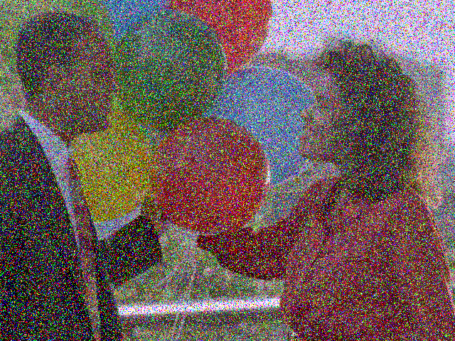
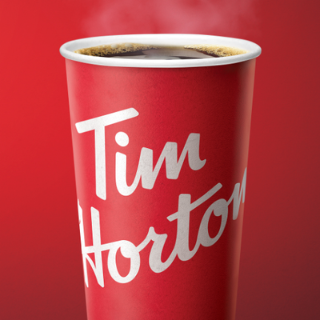
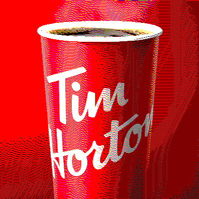
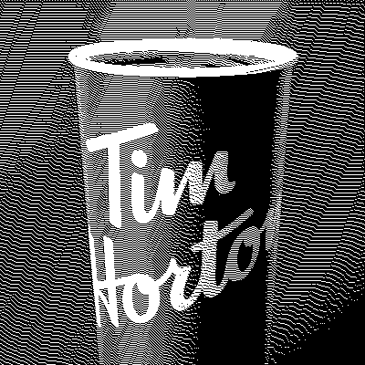
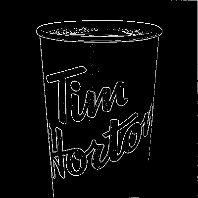
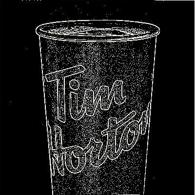
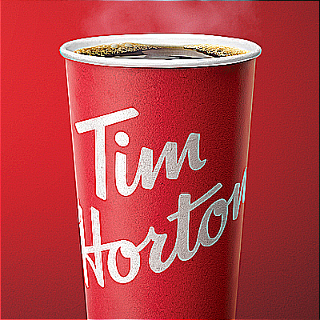

# Image Filters - An image processing desktop application built with JavaFX

#### How to run the program?
- Download and extract latest release
- Run ImageFilters.exe
- **No Java installation required!**

#### Features:
- Open and save images (supported image formats: .png | .jpeg | .jpg | .gif)
- Undo / Redo transformations (Stack size is set to 10 for performance)
- Process your images with the provided filters and options

#### List of filters:
- Gaussian Blur filter - different blur strengths can be selected to smooth image, details are lost
- Sharpen filter - brings out the details of an image
- Edge Detection filter - displays the details of an image in black and white
- Dithering filter - reduces color palette while giving illusion of more colors
- Median Filter - removes noise and smooths image while preserving details

#### Filter Examples:

Image with noise          |   Median Filter applied five times
:-------------------------:|:-------------------------:
  |  

Original image          |  Blur with σ = 1.0
:-------------------------:|:-------------------------:
  |  

Original image            |   Blur with σ = 5.0
:-------------------------:|:-------------------------:
  |  

Original image         |   Dither with eight color RGB palette
:-------------------------:|:-------------------------:
  |  

Original image           |   Dither with black and white palette
:-------------------------:|:-------------------------:
  |  

Original image           |   Edge detection with weight = 6.0
:-------------------------:|:-------------------------:
  |  

Original image         |   Edge detection with weight = 1.5
:-------------------------:|:-------------------------:
  |  

Original image       |   Sharpened image
:-------------------------:|:-------------------------:
  |  
